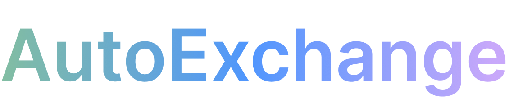

<div align="center">
  
</div>

<h1 align="center">AutoExchange</h1>

<p align="center">
  Revolutionizing the car buying experience for the modern digital consumer.
  <br>
  <a href="https://autoexchange.netlify.app"><strong>Explore the AutoExchange platform »</strong></a>
  <br>
  <br>
  <a href="https://github.com/unidrelyn/Project-Final-Auto/issues">Report Bug</a>
  ·
  <a href="https://github.com/unidrelyn/Project-Final-Auto/issues">Request Feature</a>
</p>

---

## Table of Contents
- [About AutoExchange](#about-autoexchange)
- [Features](#features)
- [Getting Started](#getting-started)
- [Code Overview](#code-overview)
  - [Dependencies](#dependencies)
  - [Folder Structure](#folder-structure)
  - [Authentication](#authentication)
- [Roadmap](#roadmap)
- [Contributing](#contributing)
- [License](#license)
- [Contact](#contact)

---

## About AutoExchange

<div align="center">
  
</div>

At AutoExchange, we empower individuals to buy or sell vehicles with ease and efficiency. Our platform integrates cutting-edge technology to provide a seamless experience, offering a vast selection of vehicles and a robust network of dealers.

## Features

- **Personalized Car Journey**: Navigate through a vast selection of cars to find the one that suits your style and budget.
- **Trusted Dealer Network**: Access over 10,000 certified dealers, making it simple to find trusted and verified sellers.
- **User-Centric Design**: Enjoy a platform designed with the user's experience in mind, offering intuitive navigation and detailed car information.

## Getting Started

To get a local copy up and running follow these simple steps.

### Installation

```sh
git clone https://github.com/unidrelyn/Project-Final-Auto.git
cd Project-Final-Auto
npm install
npm start